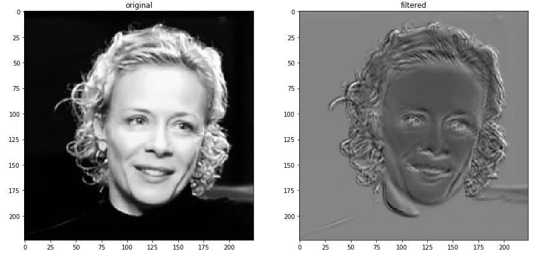
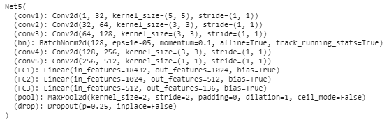
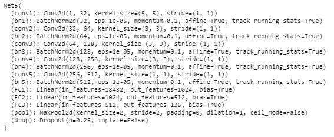
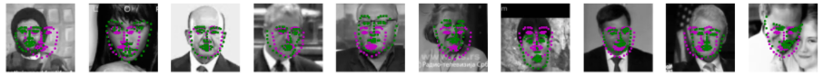
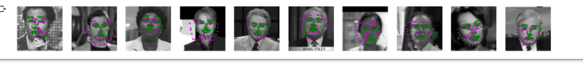

# Keypoints-face-detection
detection of 68 facial keypoints from images using Deep CNN

This project is the first project from Udacity's Computer Vision Nanodegree.

The objective is to train a deep neural network to detect and predict 68 facial keypoints from a picture. Facial keypoints include points around the eyes, nose, and mouth on a face and are used in many applications. These applications include: facial tracking, facial pose recognition, facial filters, and emotion recognition. Your completed code should be able to look at any image, detect faces, and predict the locations of facial keypoints on each face.

The CNN takes any images as an input, pre-process them (converting to grayscale and 224x224) and outputs 68 coordinate tuples, one for each keypoint. The training is performed on a set of images taken from [YouTube Faces Dataset](https://www.cs.tau.ac.il/~wolf/ytfaces/). This facial keypoints dataset consists of 5770 color images. All of these images are separated into either a training or a test set of data.

The project comprises 4 notebooks:
- Notebook 1 : Loading and Visualizing the Facial Keypoint Data
- Notebook 2 : Defining and Training a Convolutional Neural Network (CNN) to Predict Facial Keypoints
- Notebook 3 : Facial Keypoint Detection Using Haar Cascades and your Trained CNN
- Notebook 4 : Fun Filters and Keypoint Uses

The CNN model architecture is defined in the `models.py` file.
The architecture I used was inpired by this [paper](https://arxiv.org/pdf/1710.00977.pdf).

Feature extraction looking at the conv1 filters is performed at the end of the Notebook 2. A sample is shown below.

## Network architecture

From the paper "Facial Key Points Detection using Deep Convolutional Neural Network - NaimishNet", i decided to replicate a similar model made of 4 Conv blocks (Conv-Activation-Maxpool-DropOut), 2 dense blocks (Dense-Activation-DropOut) before a final fully connected layer with 136 outputs (68x2). I stayed as close to the proven solutions. The last layer delivering the predictions is modified compared to the paper. I adjusted the kernel size in the Conv layers and opted for 5 on the larger input image, the following being size of 3. I kept stride to 1 throughout and adjusted padding to maintain xy dimensions leaving the maxpooling(2,2) layers playing its dimensionality-reduction role. The resulting feature volume at the end of the Conv blocks, and before the fully connected section, is 14 x 14 x 256. The FC section outputs 2048 nodes then 1024 then 136.

A lighter architecture gave similar results.
This one is composed of 5 Conv blocks (Conv->ReLu->MaxPool) going from 32 to 512 depth with kernel size of 5 for the input then a serie of 3, the last one being 1. Stride of 1, no padding. This is followed by 3 FC layers: 2 x (FC->ReLu->DropOut(0.25)) -> FC with output 136. The feature volumes fed to the FC section is 6 x 6 x 512. This allows to reduce the number of nodes to 1024 then 512 then 136.

Lighter architecture summary:

The best results were achieved with this lighter architechture adding BatchNormalization in between each of the 5 Convs and the activations. Performance was already better even after 10 epochs.

Best architecture summary:

## Results

Sample predictions after 40 epochs with the lighter architecture.

Sample predictions after 40 epochs with the lighter architecture.

